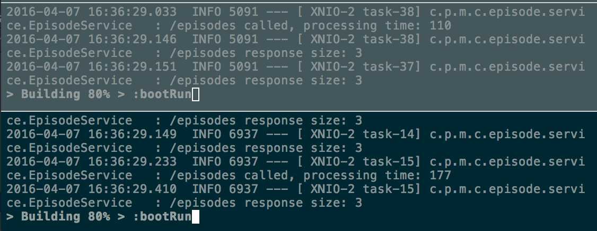



## Introduction
In the [introduction](introduction.html) we presented an operations model that will be gradually
realized in this and subsequent articles. This article realizes the base services, made up by one
composite service and three core services, the service discovery service (Eureka), the edge server
(Zuul), and the load balancer (Ribbon). Throughout the article series we will use a number items
from the [Spring Cloud](http://projects.spring.io/spring-cloud/) family. To a large extent Spring
Cloud is based on components from [Netflix OSS](http://netflix.github.io/).

## Alpha Overview
To be able to develop and test our microservices we need an overview of the system landscape we want
to build. Below is the landscape that we will develop as part of Alpha. In subsequent articles we
will extent this landscape to finally match the landscape presented in
[introduction](introduction.html).


The composite service, *Patient-composite*, aggregates data of the three core services: *Patient*,
*Observation*, and *Episode*. To support these services a *Service Discovery* service is provided
(Eureka). In addition there is the service that provides *Dynamic Routing* and *Load Balancing*
(Ribbon). The *Edge Server* (Zuul) is put in place as well. Note that the security aspect is not
yet part of this article. In other words, you will be able to directly target the core services
bypassing the edge server (see below).

## Source
To get the source used in the remainder of this article you can checkout the GIT repo.
  
```bash
$ git clone https://github.com/bastijnv/hsdp-ade-demo.git
$ cd hsdp-ade-demo
$ git checkout -b alpha
```

In true microservice spirit, each component is built separately and thus has its own build file.
[Gradle](http://gradle.org/) is used as the build system. For convenience a script is available to
build all the microservices in one command.

```bash
$ ./build-all.sh
```

> *Note:* Windows users should use the build-all.bat file.

Running the command should result in six times `BUILD SUCCESSFUL`, for each of the microservices
introduced above.

## Source Code Overview
Now that we have our source code checked out and built, let's walk through the code architecture and
highlight the key elements. Each microservice is a standalone
[Spring Boot](http://projects.spring.io/spring-boot/) application using [Undertow](http://undertow.io/)
as its web server.
[Spring MVC](http://docs.spring.io/spring/docs/current/spring-framework-reference/html/mvc.html) is
used to implement the REST based services.

### Gradle
Spring Cloud has defined a set of starter dependencies to kickstart development. To use Eureka and
Ribbon in a microservice we only have to add the following dependency to our gradle build file:

```
compile("org.springframework.cloud:spring-cloud-starter-eureka:1.0.0.RELEASE")
```

A complete gradle file can be found
[here](https://github.com/bastijnv/hsdp-ade-demo/blob/alpha/microservices/core/patient-service/build.gradle).
In the same way we can add the dependency for an Eureka server to our Discovery Server microservice 
([see also](https://github.com/bastijnv/hsdp-ade-demo/blob/alpha/microservices/support/discovery-server/build.gradle)):

```
compile('org.springframework.cloud:spring-cloud-starter-eureka-server:1.0.0.RELEASE')
```

### Support microservices
In Alpha we use two supporting microservices: edge-server (Eureka) and discovery-server (Zuul).
Spring helps us to setup these services quickly. For example, to setup an Eureka server we can add
`@EnableEurekaServer` to a standard Spring application.

```java
@SpringBootApplication
@EnableEurekaServer
public class EurekaApplication {

    public static void main(String[] args) {
        SpringApplication.run(EurekaApplication.class, args);
    }
}
```

The complete code is not much more than shown above, as you can see in
[EurekaApplication.java](https://github.com/bastijnv/hsdp-ade-demo/blob/alpha/microservices/support/discovery-server/src/main/java/com/philips/microservices/support/discovery/EurekaApplication.java).
Zuul is setup in a similar manner using `@EnableZuulProxy` as can be seen in
[ZuulApplication.java](https://github.com/bastijnv/hsdp-ade-demo/blob/alpha/microservices/support/edge-server/src/main/java/com/philips/microservices/support/edge/ZuulApplication.java).

The above code sets up a default instance of Eureka and Zuul. The default setting can be easily
overridden to fit your project requirements. For instance, in our case we want Zuul to only allow
routing calls to our patient-composite service and block any requests to the core services. This
can be done by placing the following code in the
[application.yml](https://github.com/bastijnv/hsdp-ade-demo/blob/alpha/microservices/support/edge-server/src/main/resources/application.yml).

```yml
zuul:
  ignoredServices: "*"
  routes:
    patientcomposite:
      path: /patientcomposite/**
```

### Microservices
Alpha has four microservices, three of them are referred to as the core services (patient,
observation, episode) and one composite service (patient-composite). The important parts of these
services are how they handle subscribing themselves with the discovery server, and the dynamic
routing (load balancing).

To let a microservice automatically register itself with the Eureka discovery server we only have to
add `@EnableDiscoveryClient` to the Spring boot application as can be seen in
[PatientCompositeServiceApplication.java](https://github.com/bastijnv/hsdp-ade-demo/blob/alpha/microservices/composite/patient-composite-service/src/main/java/com/philips/microservices/composite/patient/PatientCompositeServiceApplication.java)
for example.

```java
@SpringBootApplication
@EnableDiscoveryClient
public class PatientCompositeServiceApplication {
    public static void main(String[] args) {
        SpringApplication.run(PatientCompositeServiceApplication.class, args);
    }
}
```

As mentioned in the introduction already, Ribbon is used to help us with the dynamic routing aspect.
To lookup and call an instance of a microservice using a Spring RestTemplate we only need to know the
name of the service. Ribbon, our load balancer, will find the service instance and return its URL
to the service consumer. See
[Util.java](https://github.com/bastijnv/hsdp-ade-demo/blob/alpha/microservices/composite/patient-composite-service/src/main/java/com/philips/microservices/composite/patient/service/Util.java)
and
[PatientCompositeIntegration.java](https://github.com/bastijnv/hsdp-ade-demo/blob/alpha/microservices/composite/patient-composite-service/src/main/java/com/philips/microservices/composite/patient/service/PatientCompositeIntegration.java).

```java
@Autowired
    private LoadBalancerClient loadBalancer;
    ...
    public ResponseEntity<List<Observation>> getObservations(int patientId) {

            ServiceInstance instance = loadBalancer.choose("observation");
            URI uri = instance.getUri();
		    ...
            response = restTemplate.getForEntity(url, String.class);

```

## Testing the system
To be able to run the command below we expect you have [cURL](https://curl.haxx.se/) and
[jq](https://stedolan.github.io/jq/) at your disposal.

> They can be replaced by any other tool if you know what you are doing.

Each microservice you built before can be started via the gradle command `./gradlew bootRun`. So
the below series of commands start the services. You might want to start the supporting services
first, although this is not strictly required.

```bash
$ cd support/discovery-server;  ./gradlew bootRun
$ cd support/edge-server;       ./gradlew bootRun

$ cd core/patient-service;                 ./gradlew bootRun
$ cd core/observation-service;             ./gradlew bootRun
$ cd core/episode-service;                 ./gradlew bootRun
$ cd composite/patient-composite-service;  ./gradlew bootRun
```

Sit back and relax while the services are coming up. After a while the discovery service should
be up and running and you can browse to http://localhost:8761 to reach the Eureka page. Waiting some
more you should see the core and composite services register themselves with the discovery server.
Once they have all registered themselves with the discovery server we can start testing their
functionality.


Now we can start and execute some cURL commands in our terminal to test the services. First, let's
find out what services are running on what addresses.

```bash
$ curl -s -H "Accept: application/json" http://localhost:8761/eureka/apps |
 jq '.applications.application[] |
 {service: .name, ip: .instance.ipAddr, port: .instance.port."$"}'
```
Which should return something similar to what is displayed below.

```json
{
  "service": "OBSERVATION",
  "ip": "10.10.5.106",
  "port": "65522"
}
{
  "service": "PATIENTCOMPOSITE",
  "ip": "10.10.5.106",
  "port": "41420"
}
{
  "service": "EPISODE",
  "ip": "10.10.5.106",
  "port": "41533"
}
{
  "service": "PATIENT",
  "ip": "10.10.5.106",
  "port": "40738"
}
{
  "service": "EDGESERVER",
  "ip": "10.10.5.106",
  "port": "8765"
}
```

Great, our services are up and running and all of them have registered themselves with the discovery
server. Time to call the composite service through the edge server. We know the edge server is found
on port 8765 (seen in its application.yml as well as returned from our previous curl command). From
the Zuul settings we now we can reach the patient-composite at `/patientcomposite/**`. Thus we can
run the following command to get a patient.

```bash
$ curl -s localhost:8765/patientcomposite/patient/1 | jq .
```

If you watch the logging in the terminal windows (tabs, splits) where you started your services you
should see the requests come in and being handled. Note that the first time may be a bit slow, or
even sometimes not return anything at all. Running a second time usually solves the problem. In
production code you would of course solve this issue but for the sake of the tutorial I left it
untouched. The response should be something similar to the following:

```json
{
  "patientId": 1,
  "name": "name",
  "birthDate": "01-01-2000",
  "observations": [
    {
      "observationId": 1,
      "type": "Steps",
      "value": 100
    },
    {
      "observationId": 2,
      "type": "HearthRate",
      "value": 63
    },
    {
      "observationId": 3,
      "type": "Steps",
      "value": 400
    }
  ],
  "episodes": [
    {
      "episodeId": 1,
      "referral": "Acme",
      "tac": "eCAC"
    },
    {
      "episodeId": 2,
      "referral": "Acme",
      "tac": "eTrAC"
    },
    {
      "episodeId": 3,
      "referral": "Acme",
      "tac": "eTrAC"
    }
  ]
}
```

Now, since not protection is yet in place, we can also directly call the core services bypassing
the edge server. We do not know which dynamic address was assigned to them but using the output
from our earlier Eureka REST api call we can look them up.

```bash
$ curl -s localhost:41420/patient/1 | jq .
$ curl -s localhost:40738/patient/1 | jq .
$ curl -s localhost:41533/episode?patientId=1 | jq .
$ curl -s localhost:65522/observation?patientId=1 | jq .
```

No that we have verified that is working we can spin up a new instance of the episode service.
Having multiple instances up for a single service is common practice to prevent failures due to
network outage or crashing services. Adding a new instance is as easy as starting another instance
since service discovery handles the rest for us.

```bash
$ cd core/episode-service
$ ./gradlew bootRun
```

After a while you should see the registered service in your eureka page. Under the status message
for the episode service it should now say **up**(*2*) instead of **up**(1). If you run the previous
curl command to the patientcomposite a few times and watch the logs of the episode services you
should see both services responding. To make sure the calls are made fast enough after each other
to let the load balancer balance them you can run the following command.

```bash
$ ab -n 30 -c 5 localhost:8765/patientcomposite/patient/1
```



## Wrap-up
We have introduced our first four business services and two supporting services. We have shown
how to build and run them and ran some tests against them. Instances automatically register
themselves with the discovery server and when multiple instances are available of a single
service the load balancer automatically routes the requests to the available services. We have a
basic implementation of the edge server which gives control over which servers are exposed to the
public. However, the internal services weren't protected yet so after looking up their addresses in
Eureka we are still able to target them directly.

In our [next](beta.html) article we will introduce a circuit breaker and health monitoring.

