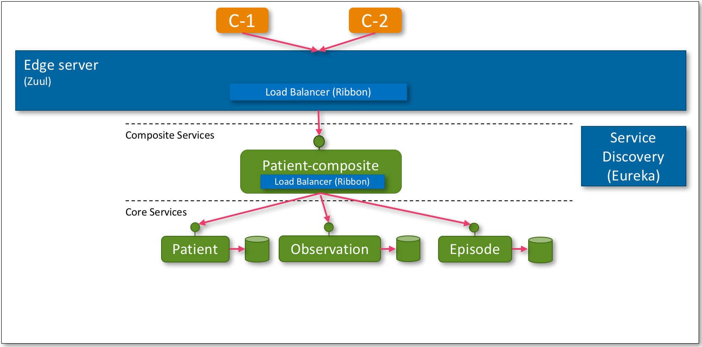



## Introduction
In the [introduction](introduction.html) we presented an operations model that will be gradually realized in this and subsequent articles. 
This article realizes the base services, made up by one composite service and three core services, the service discovery service (Eureka), 
the edge server (Zuul), and the load balancer (Ribbon). Throughout the article series we will use a number items from the 
[Spring Cloud](http://projects.spring.io/spring-cloud/) family. To a large extent Spring Cloud is based on components from 
[Netflix OSS](http://netflix.github.io/). 

## Alpha Overview
To be able to develop and test our microservices we need an overview of the system landscape we want to build. Below is the 
landscape that we will develop as part of Alpha. In subsequent articles we will extent this landscape to finally match the 
landscape presented in [introduction](introduction.html).



The composite service, *Patient-composite*, aggregates data of the three core services: *Patient*, *Observation*, and *Episode*. To support
these services a *Service Discovery* service is provided (Eureka). In addition there is the service that provides *Dynamic Routing* 
and *Load Balancing* (Ribbon). The *Edge Server* (Zuul) is put in place as well. Note that the security aspect is not yet part of this
article. In other words, you will be able to directly target the core services bypassing the edge server (see below).

## Source
To get the source used in the remainder of this article you can checkout the GIT repo.
  
```bash
$ git clone https://github.com/bastijnv/hsdp-ade-demo.git
$ cd hsdp-ade-demo
$ git checkout -b alpha
```