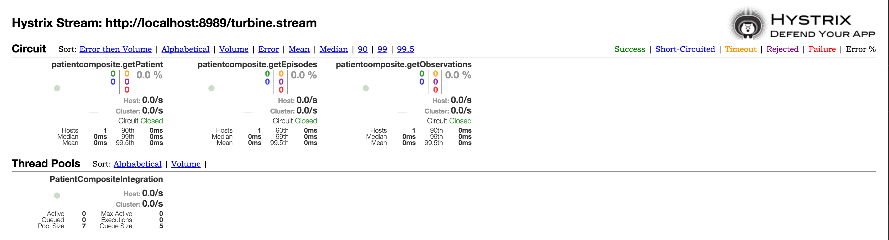
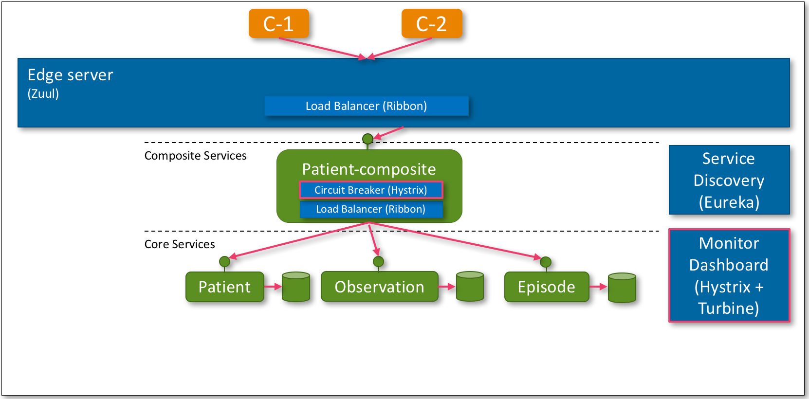
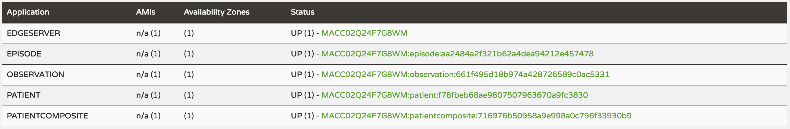
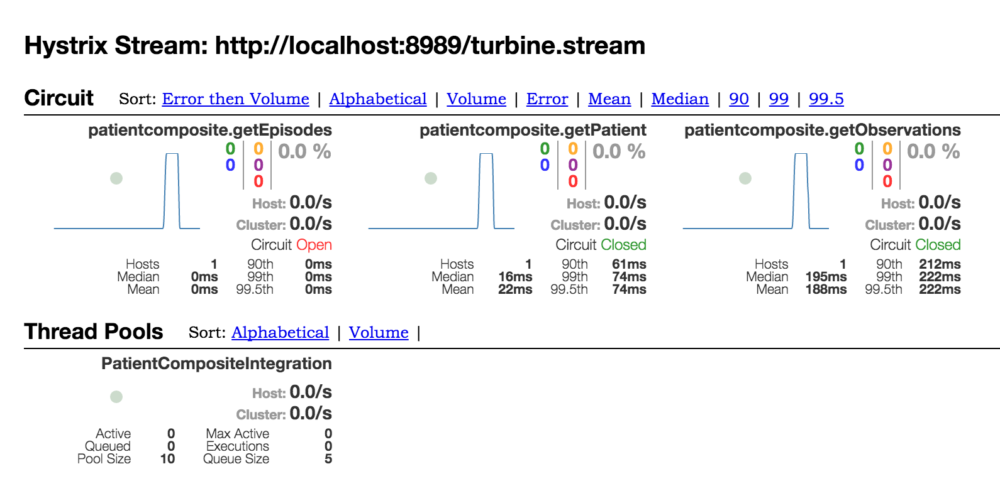



## Introduction
In a microservice landscape there is a big risk a certain day and time a microservice might no longer respond, 
or its responses are so delayed the system is no longer functional. This non-behaving microservice might in turn
cause other microservices that depend on it fail. This fenomenom is called *chain of failure*, where errors in
one component can cause other components to fail that depend on it. With a potential large number of microservices
you might understand this needs to be monitored and handled constantly.

One way to handle this is discussed in the remainder of this article. There are multiple ways to do this but in 
this series we will be using a *circuit breaker* ([Hystrix](https://github.com/Netflix/Hystrix)). For an 
introduction on circuit breakers read [Fowler's post](http://martinfowler.com/bliki/CircuitBreaker.html). 
A typical circuit breaker applies state transitions like seen in the image below. When a service is behaving 
as expected the circuit will be closed and business is as usual. Requests are made to the target service. 
When a service starts failing the circuit breaker waits for a threshold to be reached after which it opens 
the circuit. An open circuit will prevent the request to the target service is not made but a cached 
response is returned immediately. After a set period the circuit breaker will test if the circuit can 
be closed again by allowing some request to pass to the target request. When the target service is available 
again the circuit will be closed again.


[Turbine](https://github.com/Netflix/Turbine) can provide the *Hystrix Dashboard* from information on all 
circuit breakers in the system, which it can obtain from Eureka. A sample Hystrix dashboard is shown below.



## Beta Overview
To be able to develop and test our microservices we need an overview of the system landscape we want to build. 
Below is the landscape that we will develop as part of Beta. Highlighted in red are the added *circuit breaker* 
and *monitor dashboard*. In subsequent articles we will extent this landscape to finally match the landscape 
presented in [introduction](introduction.html).



## Source
To get the source used in the remainder of this article you can checkout the GIT repo.
  
```bash
$ git clone https://github.com/bastijnv/hsdp-ade-demo.git
$ cd hsdp-ade-demo
$ git checkout -b beta
```

## Source Code Overview
### Gradle
We need to add Hystrix to our dependencies. In addition we need to add [RabbitMQ]() which is used 
by Hystrix to communicate between circuit breakers and dashboards.

Our services that want to use Hystrix have to add the following dependencies to their gradle file. 
You can see an example in [patient-composite-service/build-gradle](https://github.com/bastijnv/hsdp-ade-demo/blob/beta/microservices/composite/patient-composite-service/build.gradle).

```gradle
compile("org.springframework.cloud:spring-cloud-starter-hystrix:1.0.0.RELEASE")
compile("org.springframework.cloud:spring-cloud-starter-bus-amqp:1.0.0.RELEASE")
compile("org.springframework.cloud:spring-cloud-netflix-hystrix-amqp:1.0.0.RELEASE")
```

In addition you have to add the following dependency to [turbine/build.gradle](https://github.com/bastijnv/hsdp-ade-demo/blob/beta/microservices/support/turbine/build.gradle)

```
compile('org.springframework.cloud:spring-cloud-starter-turbine-amqp:1.0.0.RELEASE')
```

### Support microservices
Using Spring it is straightforward to setup a Turbine server. All we have to do is add the `@EnableTurbineAmqp` 
annotation to a spring boot application. See the code below which can be found in 
[TurbineApplication.java](https://github.com/bastijnv/hsdp-ade-demo/blob/beta/microservices/support/turbine/src/main/java/com/philips/microservices/support/turbine/TurbineApplication.java).

```java
@SpringBootApplication
@EnableTurbineAmqp
@EnableDiscoveryClient
public class TurbineApplication {

    public static void main(String[] args) {
        SpringApplication.run(TurbineApplication.class, args);
    }

}
```

A Hystrix Dashboard is setup with the same ease adding `@EnableHystrixDashboard` to a spring boot application 
as seen in [HystrixDashboardApplication.java](https://github.com/bastijnv/hsdp-ade-demo/blob/beta/microservices/support/monitor-dashboard/src/main/java/com/philips/microservices/support/monitordashboard/HystrixDashboardApplication.java). This gives us a default 
Turbine server and Hystrix dashboard!

### Microservices
Next we have to use Hystrix in our microservices. This is done by adding an `@EnableCircuitBreaker` annotation 
to our microservices as seen in [PatientCompositeServiceApplication.java](https://github.com/bastijnv/hsdp-ade-demo/blob/beta/microservices/composite/patient-composite-service/src/main/java/com/philips/microservices/composite/patient/PatientCompositeServiceApplication.java). 
In addition, add the `@HystrixCommand` to the method that Hystrix should monitor. The command can be given a default 
fallback-method as shown in the code sample below (taken from [PatientCompositeIntegration.java](https://github.com/bastijnv/hsdp-ade-demo/blob/beta/microservices/composite/patient-composite-service/src/main/java/com/philips/microservices/composite/patient/service/PatientCompositeIntegration.java)). 
The fallback method is called when the circuit is open or when the monitored method fails due to e.g. a timeout.

```java
@HystrixCommand(fallbackMethod = "defaultPatient")
public ResponseEntity<Patient> getPatient(int patientId) {
	...
}

public ResponseEntity<Patient> defaultPatient(int patientId) {
    ...
}
```
Great, the code is there now build it using `build-all.sh` and let's try it out!

## Testing the system
> As in [Alpha](alpha.html), to be able to run the commands below we expect you have [cURL](https://curl.haxx.se/) and
> [jq](https://stedolan.github.io/jq/) at your disposal. You can replace these with any other tools 
> with similar functionality if you know what you are doing.

You can start all services as explained in the [previous](alpha.html) article. In addition you have to run RabbitMQ locally 
for Hystrix to work. If you do not have RabbitMQ installed you can download it [here](https://www.rabbitmq.com/download.html). 
Follow the instructions and return here when RabbitMQ is running.
>MacOSX users should really use *homebrew* to install.

```bash
─310044780@MACC02Q24F7G8WM  ~/views/ade-demo/microservices  ‹beta›
╰─$ rabbitmq-server                                             127 ↵

              RabbitMQ 3.6.0. Copyright (C) 2007-2015 Pivotal Software, Inc.
  ##  ##      Licensed under the MPL.  See http://www.rabbitmq.com/
  ##  ##
  ##########  Logs: /usr/local/var/log/rabbitmq/rabbit@localhost.log
  ######  ##        /usr/local/var/log/rabbitmq/rabbit@localhost-sasl.log
  ##########
              Starting broker... completed with 10 plugins.
```
Now start all microservices.
```bash
$ cd support/discovery-server;  ./gradlew bootRun
$ cd support/edge-server;       ./gradlew bootRun
$ cd support/monitor-dashboard; ./gradlew bootRun
$ cd support/turbine;           ./gradlew bootRun

$ cd core/patient-service;                 ./gradlew bootRun
$ cd core/observation-service;             ./gradlew bootRun
$ cd core/episode-service;                 ./gradlew bootRun
$ cd composite/patient-composite-service;  ./gradlew bootRun
```
Wait for the magical `DiscoveryClient ... - registration status: 204` to appear on your started services to indicate they are ready.
Remember that Eureka will also tell you this at http://localhost:8761.



Test that the circuits are closed by running a simple query. 

> There is a known issue with the code that it might not return the response on first call. Calling the curl
> command a couple of times usually fixes the issue. This might be fixed in the future. After a successful 
> response the issue no longer appears.

```bash
curl -s localhost:8765/patientcomposite/patient/1 | jq .
{
  "patientId": 1,
  "name": "name",
  "birthDate": "01-01-2000",
  "observations": [
    {
      "observationId": 1,
      "type": "Steps",
      "value": 100
    },
    {
      "observationId": 2,
      "type": "HearthRate",
      "value": 63
    },
    {
      "observationId": 3,
      "type": "Steps",
      "value": 400
    }
  ],
  "episodes": [
    {
      "episodeId": 1,
      "referral": "Acme",
      "tac": "eCAC"
    },
    {
      "episodeId": 2,
      "referral": "Acme",
      "tac": "eTrAC"
    },
    {
      "episodeId": 3,
      "referral": "Acme",
      "tac": "eTrAC"
    }
  ]
}
``` 

Now that that works, go to your Hystrix dashboard at http://localhost:7979/. You should see the dashboard below.


Three circuit breakers are operational for the composite service, one for each core service. All circuit breakers
are closed, which is what we expected to see. Now let's change that, let's break something! Stop the *episode* 
service and retry the above command.

```bash
curl -s localhost:8765/patientcomposite/patient/1 | jq .
{
  "patientId": 1,
  "name": "name",
  "birthDate": "01-01-2000",
  "observations": [
    {
      "observationId": 1,
      "type": "Steps",
      "value": 100
    },
    {
      "observationId": 2,
      "type": "HearthRate",
      "value": 63
    },
    {
      "observationId": 3,
      "type": "Steps",
      "value": 400
    }
  ],
  "episodes": null
}
```
Uh oh, we lost our episode data in the reponse since the service no longer was able to send it. 
If we look at the logs of our *patient-composite* service we see that it reported this with a warning.

```bash
2016-05-14 23:52:16.982  INFO 46011 --- [teIntegration-4] c.p.m.c.p.s.PatientCompositeIntegration  : GetEpisodes...
2016-05-14 23:52:16.983  INFO 46011 --- [teIntegration-6] c.p.m.c.p.s.PatientCompositeIntegration  : GetObservations...
2016-05-14 23:52:16.983  WARN 46011 --- [teIntegration-4] c.p.m.composite.patient.service.Util     : Failed to resolve serviceId 'episode'. Fallback to URL 'http://localhost:8081/episode'.
2016-05-14 23:52:16.987  WARN 46011 --- [teIntegration-4] c.p.m.c.p.s.PatientCompositeIntegration  : Using fallback method for episode-service
```

The circuit breaker has detected a problem with the episode service and routed the caller to the fallback method. The fallback method was 
implemented to return null but we could, for example, return data from a local cache to provide a best effort result when the episode service 
is unavailable. Note that the circuit is still closed since the error is not that frequent. Let's change that by making lots of calls to 
exceed the threshold.

```
ab -n 30 -c 5 localhost:8765/patientcomposite/patient/1
```
That should have opened the circuit as shown in the screenshot below.



If you now make the previous curl command again you should see the `GetReviews` is short-circuited and no longer called. It 
should no longer show up in your logs.

```
2016-05-14 23:55:07.467  INFO 46011 --- [teIntegration-9] c.p.m.c.p.s.PatientCompositeIntegration  : GetObservations...
2016-05-14 23:55:07.654  WARN 46011 --- [ XNIO-2 task-36] c.p.m.c.p.s.PatientCompositeIntegration  : Using fallback method for episode-service
```

If you wait for a bit and repeat the call a couple of times you should see some of the requests pass through to test
if the episode service is back up. Let's get the episode service back online (start it again) and see if the 
circuit gets closed again. Wait for the service to be registered with Eureka and make a couple of calls to close the circuit.
The response should include the episode data again and the dashboard page should show all circuits are closed.

## Wrap-up
We have introduced Hystrix and shown its use in a microservice landscape. We tested its functionality by manually killing
our episode service and forcing a number of failed calls. The circuit opened and the request to the episode service was
no longer made but instead short-circuited with a default fallback method.

In the [next](gamma.html) article we will secure our services!
