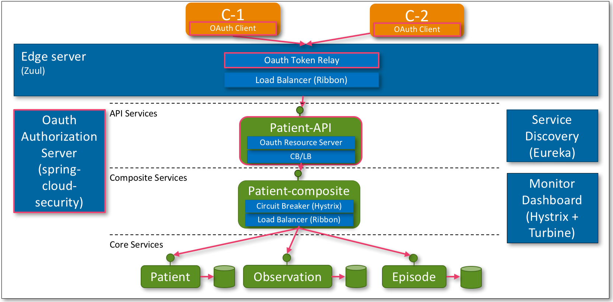



## Introduction
Security is an important topic for any application. In a microservice architecture it requires some additional work as each 
microservice has to verify the authentication and authorization of the current user. Luckily, our Edge server simplifies this.

For an introduction to OAuth2 read the article by [Digital Ocean](https://www.digitalocean.com/community/tutorials/an-introduction-to-oauth-2). 
Readers who are really interested can also browse the [specification](https://tools.ietf.org/html/rfc6749). As mentioned before, in this
series security is handled in two steps. First of all, to prevent unauthorized access to the internal microservices we use [Zuul](https://github.com/Netflix/zuul) as our *Edge Server* that all external traffic goes through. The remaining exposed API services are protected by applying *OAuth2* via 
[Spring Cloud](http://projects.spring.io/spring-cloud/) and [Spring Cloud Security OAuth2](http://projects.spring.io/spring-security-oauth/). 

## Gamma Overview
To be able to develop and test our microservices we need an overview of the system landscape we want to build. Below is the landscape that we will develop as part of Gamma. 
In subsequent articles we will extent this landscape to finally match the landscape presented in [introduction](introduction.html).



The four roles in OAuth are: (1) Resource Owner, (2) Client, (3) Resource Server, (4) Authorization Server. In our operations model 
shown in the overview below we introduce an *OAuth Authorization Server* as a separate component. The API services will act as *OAuth Resource Server* and the
external API consumers will be the *OAuth Resource Clients*. Finally, the edge server will act as *OAuth Token Relay* meaning it is an
*OAuth Resource Server* that passes through the *OAuth Access Tokens* that are contained in the external requests to the API services.
Note that the role of Authorization Server is often
taken by either public providers such as Facebook, Google, or LinkedIN, or by of-the-shelve packages as ForgeRock. Later in this article series
we will address this in more detail. In the remainder of this article we will test all four authorization grant flows to get an access token from the Authorization server. 

> Note that when we talk security doing everything over HTTP is not advised. In any real world scenario you should
> route all your traffic over HTTPS. For the sake of keeping things simple in this series we will continue to 
> use HTTP exclusively.

## Source
To get and build the source used in the remainder of this article you can checkout the GIT repo.
  
```bash
$ git clone https://github.com/bastijnv/hsdp-ade-demo.git
$ cd hsdp-ade-demo
$ git checkout -b gamma
$ ./build-all.sh
```

## Source Code Overview

### Gradle
Again Spring Cloud is going to help us out by providing two open source projects [spring-cloud-security](http://cloud.spring.io/spring-cloud-security/) 
and [spring-security-oauth2](http://projects.spring.io/spring-security-oauth/). To implement the auth server we add the following
dependencies to [auth-server/build.gradle](https://github.com/bastijnv/hsdp-ade-demo/blob/gamma/microservices/support/auth-server/build.gradle).

```bash
compile("org.springframework.boot:spring-boot-starter-security")
compile("org.springframework.security.oauth:spring-security-oauth2:2.0.6.RELEASE"		
```
and for the [patient-api-service/build.gradle](https://github.com/bastijnv/hsdp-ade-demo/blob/gamma/microservices/api/patient-api-service/build.gradle).

```bash
compile("org.springframework.cloud:spring-cloud-starter-security:1.0.0.RELEASE")
compile("org.springframework.security.oauth:spring-security-oauth2:2.0.6.RELEASE")
```

### Support microservices
Implementation of a default Authorization Server is trivial with Spring Boot. We only have to add the `@EnableAuthorizationServer` annotation and 
use a configuration class to register the clients, scopes, and allowed grant flows. Example code can be found at [AuthserverApplication.java](https://github.com/bastijnv/hsdp-ade-demo/blob/gamma/microservices/support/auth-server/src/main/java/demo/AuthserverApplication.java). This setup registers our clients in-memory only. As said before this is sufficient for a tutorial, but in the real world you would want a more sophisticated Authorization Server.

```java
@Configuration
@EnableAuthorizationServer
protected static class OAuth2Config extends AuthorizationServerConfigurerAdapter {
	
	@Override
	public void configure(ClientDetailsServiceConfigurer clients) throws Exception {
		clients.inMemory()
			.withClient("acme")
			.secret("acmesecret")
			.authorizedGrantTypes("authorization_code", "refresh_token", "implicit", "password", "client_credentials")
			.scopes("pophealth");
	}
}
```

New users can be added in [application.properties](https://github.com/bastijnv/hsdp-ade-demo/blob/gamma/microservices/support/auth-server/src/main/resources/application.properties), adding a new entry for the new user like `security.user.password=password`. The end-user pages for authentication
and user consent can be found at the [templates](https://github.com/bastijnv/hsdp-ade-demo/tree/gamma/microservices/support/auth-server/src/main/resources/templates) directory.

Spring automatically forwards the OAuth access tokens from the Edge Server to the API Service by default, so no code is required to make this work. We do,
however, modify the reverse proxy settings in [edge-server/application.yml](https://github.com/bastijnv/hsdp-ade-demo/blob/gamma/microservices/support/edge-server/src/main/resources/application.yml) to get shorter URLs.

```java
zuul:
  ignoredServices: "*"
  prefix: /api
  routes:
    patientapi: /patient/**
```

This gives URLs like <http://localhost:8765/api/patient/123> instead of <http://localhost:8765/patientapi/patient/123> as we used in the previous posts.
The route to the composite-service is also replaced with a route to the api-service.

### Microservices
The *patient-api-service* must be configured to be an OAuth Resource Server. As you might guess, again Spring helps us out by providing a
`@EnableOAuth2Resource` annotation. Annotating [PatientApiServiceApplication.java](https://github.com/bastijnv/hsdp-ade-demo/blob/gamma/microservices/api/patient-api-service/src/main/java/com/philips/microservices/api/patient/PatientApiServiceApplication.java) with this annotation is sufficient to configure the 
service to be an OAuth Resource Server.

```java
@EnableOAuth2Resource
public class PatientApiServiceApplication {
    public static void main(String[] args) {
        SpringApplication.run(PatientApiServiceApplication.class, args);
    }
}
```

The implementation of the API service can be found in [PatientApiService.java](https://github.com/bastijnv/hsdp-ade-demo/blob/gamma/microservices/api/patient-api-service/src/main/java/com/philips/microservices/api/patient/service/PatientApiService.java) and is 
similar to the patient-composite service.

```java
@RequestMapping("/{patientId}")
@HystrixCommand(fallbackMethod = "defaultPatientComposite")
public ResponseEntity<String> getPatientComposite(
    @PathVariable int patientId,
    @RequestHeader(value="Authorization") String authorizationHeader,
    Principal currentUser) {

    LOG.info("PatientApi: User={}, Auth={}, called with patientId={}", currentUser.getName(), authorizationHeader, patientId);
    URI uri = loadBalancer.choose("patientcomposite").getUri();
    String url = uri.toString() + "/patient/" + patientId;
    LOG.debug("GetPatientComposite from URL: {}", url);

    ResponseEntity<String> result = restTemplate.getForEntity(url, String.class);
    LOG.info("GetPatientComposite http-status: {}", result.getStatusCode());
    LOG.debug("GetPatientComposite body: {}", result.getBody());

    return result;
}
```

We have removed the `/patient` from the RequestMapping to be in line with the changes to the Edge Server mentioned before.


