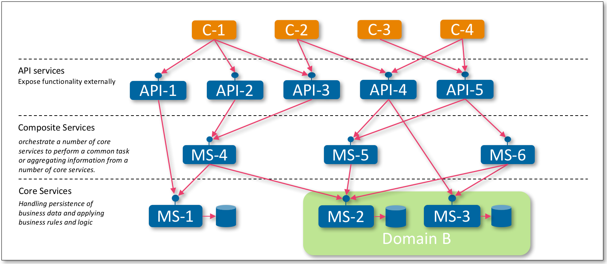



## Microservices
Microservices have been introduced many times before al over the web. If you need a good introduction please read [Martin Fowler](http://martinfowler.com/microservices/)'s 
introduction. This series continues assuming you have basic understanding of microservices.

The remainder of this article will cover three important aspects to rollout your microservice architecture.

1. Architecture
2. Operations Model
3. Continues Delivery

## Architecture
To be able to manage and maintain a microservice landscape at an enterprise scale we must define an architecture to partition our microservices. Many options 
are available here, and we by no means want to say the one presented here is the only right one. Your situation can require a different architecture, as long 
as you establish one before you start to prevent ending up with a bowl of spaghetti.

The architecture for this series discerns three layers of services:

* Core Services
* Composite Services
* API Services

Horizontally you could separate services by domain.

## Challenges

The above introduced architecture introduces a number of challenges which need to be addressed:

* **Configuration of the microservices** 
With multiple (many) microservice instances deployed across multiple servers handling configuration of those services becomes 
a considerable architectural task. How to manage all the configuration files, and how to update them at runtime.  
* **Deployment of (multiple) microservices**
We have to keep track of what microservices are deployed, and where. Which hosts and ports are exposed. Especially important 
because of the continuous changes in the system landscape
using cloud deployments.
* **Failure handling**
How to prevent a chain of failure with interconnected microservices that depend on each other. How to handle timeouts of 
microservice requests or what happens when a microservice crashes.
* **Service(s) Health monitoring**
Related to failure handling. How can we provide an overview of the health of our microservices. Which services are running, 
which are down, etc.
* **Security** 
Same as for a monolith, but this time each microservice needs to be secured.
* **Service exposure**
Part of security is managing only the right microservices are exposed to the public.
* **Inter-service communication**
For root cause analysis it should be possible to find out which microservice is the root of the problem. On a combined request, how 
can we find out which microservice is causing issues in the chain of services? 
* **Routing**
With automatic load balancing spinning up or removing instances constantly there is no time to manually update routing tables. 

## Operation Model

This section introduces an operations model that addresses the challenges mentioned in the previous section. An overview is presented 
in the figure below.

The *Central Configuration Server* addresses the first challenge of centralizing configuration management, we use [Spring Cloud Config Server](https://github.com/spring-cloud/spring-cloud-config) 
to realize this component. We use [Eureka](https://www.google.com "Eureka on Github") as our *Discovery Server*. Microservices can self-register at startup 
at this discovery server so we do not have to keep track manually about which server is (un)available. We use [Ribbon](https://github.com/Netflix/ribbon) for *Dynamic Routing* 
and *Load Balancing*. It uses the service discovery API to lookup where the requested microservice is deployed and uses that information to decide what instance 
to route the request to. We use [Hystrix](https://github.com/Netflix/Hystrix) as our *Circuit Breaker* to prevent chains of failures. With Hystrix running we combine it
with [Turbine](https://github.com/Netflix/Turbine) to monitor and collect run time statistics to get a picture of the overall system health.

Security is handled in two steps. First of all, to prevent unauthorized access to the internal microservices we use [Zuul](https://github.com/Netflix/zuul) as our
*Edge Server* that all external traffic goes through. This edge server will act as a reverse proxy and doesn't need to be manually updated each 
time a microservice is added. The edge server can reuse the dynamic routing and load balancing capabilities based 
on the service discovery component described above. The remaining exposed API services are protected by applying *OAuth2* via 
[Spring Cloud](http://projects.spring.io/spring-cloud/) and [Spring Cloud Security OAuth2](http://cloud.spring.io/spring-cloud-security/). 
Digital Ocean has a [great introduction](https://www.digitalocean.com/community/tutorials/an-introduction-to-oauth-2) to OAuth2 if you are not familiar with it. 
The four roles in OAuth are: (1) Resource Owner, (2) Client, (3) Resource Server, (4) Authorization Server. In our operations model 
shown below we introduce an *OAuth Authorization Server* as a separate component. The API services will act as *OAuth Resource Server* and the
external API consumers will be the *OAuth Resource Clients*. Finally, the edge server will act as *OAuth Token Relay* meaning it is an
*OAuth Resource Server* that passes through the *OAuth Access Tokens* that are contained in the external requests to the API services.

Inter-service communication is implemented using the ELK stack: [Logstash](https://github.com/elastic/logstash), 
[Elasticsearch](https://github.com/elastic/elasticsearch), and [Kibana](https://github.com/elastic/kibana).

 

## Contineous Delivery
Stay tuned!